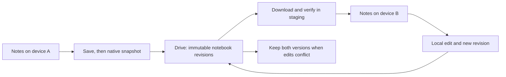

# BOOX Notes → Google Drive: feasibility and implementation plan

Updated 2026-09-12. This is an exploration, native validation experiment and
offline protocol prototype, **not an installed Notes sync replacement**.
See [APPLY-VALIDATION.md](APPLY-VALIDATION.md) for the latest runtime results and
[NATIVE-VALIDATION.md](NATIVE-VALIDATION.md) for the original export/import proof.

**Mac test-client update:** the user replaced the proposed second-BOOX test with a
subagent-built macOS reader. Android v0.2 and Mac v0.1 now pass live independent
OAuth, same-folder access, durable Android offline/restart/retry publication,
Mac download/render, and a Mac descendant downloaded/staged by Android.
See [INTEROPERABILITY-VALIDATION.md](INTEROPERABILITY-VALIDATION.md).
Transport is bounded/manual and native library application remains off.

**Latest update:** the bounded pen/link fixture now updates in place while
retaining notebook/page/existing stroke identities. Native reopen/export passes,
an inbound link retains its destination, and 24 live fault/guard cases validate
the durable recovery helper. Forty offline cases pass. Production app-open
coordination, general native formats and automatic recovery remain open.
An independent Android Google authorization/Drive preview v0.1 is built and installed.
Ten Android tests pass. The dedicated project/client is registered, real Google
authorization succeeds, and the app created its managed BOOX Notes Sync directory.
The disposable notebook upload/download passed exact byte verification and cleanup.
Manual reconnect after process restart retained its account and folder without
another consent prompt. See [Android validation](android/README.md).
The older proposed-design sections below retain the broader implementation scope.

The intended result is editable notebook sync between rooted BOOX devices, or
devices equipped with a compatible Notes integration, using a dedicated Google
Drive directory without ONYX cloud as the transport.

**Assessment:** technically plausible. The installed firmware contains reusable
native notebook export/import and save operations. Drive storage and conflict
detection are tractable. Applying updates without losing notebook identity,
links, or unsaved edits is the main engineering uncertainty and must be proven
with a disposable notebook before deployment.

## Work completed

- Inspected the installed Notes APK and the existing KSync decompilation.
- Created the **BOOX Notes Sync** directory in the connected Google Drive account
  and verified that it is empty. The exact returned ID and URL are recorded in
  [drive-folder.json](drive-folder.json). No note content was uploaded.
- Registered the Android preview's own OAuth project/client with only `drive.file`.
  It created a separate managed directory recorded in
  [android/drive-folder.json](android/drive-folder.json). The real Drive test used
  only a bundled disposable native fixture; its upload/download checksums matched
  and the verified upload was moved to Trash.
- Located the native `.note` archive export, import, save, and sync entry points.
- Built an offline revision/conflict model with **19 passing scenario tests**.
- Completed disposable native export/import/edit experiments. Pen data, compared
  styles, page order and layers survived; a stock internal-link import bug was
  reproduced and repaired in a temporary Notes-only probe.
- Added 13 native fixture regression tests: **32 checks pass in total**.
- Retrieved current official Google Drive and Android authorization documentation;
  URLs and local copies are in [research/sources.json](research/sources.json).

The temporary probe was removed and its Notes scope deactivated. Original
notebooks are preserved; 182 original document files and the original NoteModel
rows match the backup. Test notebooks/export files were removed and Wi-Fi was
restored. ONYX settings, root/framework configuration, OneNote and the OpenAI
connector are unchanged. Component backups contain private app data; no
credentials were extracted or used.

## What the installed code establishes

The inspected Notes package is `com.onyx.android.note`, version code `45326`,
version name `45326 - c2a16c15d32`. Original APK SHA256:
`a70dd9e9a67d54cc0102b12f4af6b8ba3a651d16c3e323521dd02d78a6abc271`.
See [device inspection](research/device-inspection.json). Decompiled source is
design evidence, not a substitute for runtime tests. JADX produced 27,654 of
27,656 classes before its remaining work was stopped; the referenced classes
were produced.

| Finding | Evidence | Consequence |
| --- | --- | --- |
| ONYX sync uses Couchbase Lite replication, gateway authentication, and a conflict resolver. | `ksync-decompiled/.../couch/CouchHolder.java:108–116,229–237`; `.../note/couch/NoteDocReplicator.java` | A Drive URL cannot replace the ONYX endpoint. Drive needs its own sync protocol. |
| A native editable notebook export already exists for third-party services. | `SyncNoteFileToThirdPartyNoteAction.java:60–95` builds format `5` and calls `ExportNoteToFileAction`. | Reuse the native serializer rather than reverse-engineering every stroke or copying a live database. |
| `.note` export is a ZIP archive containing native notebook data. | `ExportNoteToFileAction.java:166–221,336–346`; `PageListShapeData.java:53–59,112–150` | Pen/page/layer fidelity now has runtime evidence. Resources, tags and other shape types remain untested. |
| Export coordinates with the native save path. | `ExportNoteToFileAction.java:361–366`; `SaveAndExportNoteAction.java:72–101` | Hook save completion and export a coherent snapshot. A filesystem watcher alone is insufficient. |
| Standard import creates a new notebook ID. | `ImportNoteFromFileAction.java:492–513` sets a random destination ID. | Keep a stable sync ID and a local-ID mapping. Blind repeated imports would duplicate notebooks. |
| Standard import omits the document mapping needed by internal page links. | Native B2 → C1 reproduction; `LinkShapeModelData.java:41–53` | Add the source/destination document mapping before copying links. The fixture probe proves this repair, not inbound-link preservation during replacement. |
| Import failure cleanup deletes destination data. | `ImportNoteFromFileAction.java:246–257` | Do **not** force its destination ID to an existing user notebook. Stage into a fresh ID first. |
| Restore contains page/document ID remapping, but also broad deletion and sync-stop operations. | `RestoreNoteListAction.java:208–254,387–425` | Its mapping logic is worth studying; its whole-library restore action is unsuitable as an automatic sync operation. |
| Native sync buttons have login and enablement checks. | `ForceSyncNoteContentAction.java:147–152,195–204,267–269`; `ControlNoteSyncAction.java:17–23` | Adapt the Notes-specific UI path to Drive state. Do not globally fake ONYX login or disable all of KSync. |

Notes paths above are under:
`research/notes-decompiled/sources/com/onyx/android/note/note/`
for actions, and
`research/notes-decompiled/sources/com/onyx/android/sdk/`
for SDK code. A short machine-readable source index is in
[research/code-evidence.json](research/code-evidence.json).

The native third-party export explicitly disables `exportStashArchivedData`.
An independently configured snapshot exporter should make that choice explicit;
preserve archived content for the first fidelity test. Templates, rich text,
recordings, embedded resources, locks, and inter-notebook links are separate
test cases, not assumed supported because an export method exists.

## Proposed first implementation



A separate `local.boox.notesdrive` companion would own Google authorization,
the chosen Drive folder, revision history, a durable local job queue, and visible
sync status. A narrowly scoped Notes hook would provide export/apply operations
and save notifications. Keep this independent of the working OpenAI adapter.

Use a visible Drive directory, with app-managed immutable payloads and revision
records. An illustrative layout is:

```text
BOOX Notes Sync/
  protocol.json
  notebooks/<stable-sync-id>/
    payloads/<sha256>.note
    revisions/<revision-id>.json
```

This is a proposed layout; the created folder is still empty. Drive filenames
are not unique keys: the implementation must retain Drive file IDs and validate
logical IDs and hashes, including duplicate upload results.

Each immutable revision describes its notebook, producing device, parent
revision(s), payload checksum, and optional deletion marker. Upload the complete
payload first, verify it, and publish the small revision record last. Retry using
the same logical revision ID. Derive current versions from ancestry, not device
timestamps or a shared `latest.json` that two devices could overwrite.

On each device, a durable journal records the stable sync ID, local notebook ID,
last applied revision, pending local export, and application/recovery state.
Capture local changes against the last version actually applied. Merely seeing
a remote revision must not cause an offline local edit to claim it as an ancestor.
Do not use raw ZIP hash changes as the only edit detector: native export can
generate fresh revision IDs/timestamps even when visible content is unchanged.

For an incoming update, fetch and validate into private staging, wait until the
notebook is saved and closed, and compare the local generation again immediately
before applying. Use a fresh temporary notebook for initial verification. Advance
the applied-revision journal only after the native notebook reopens and passes
readback checks. Retain the prior revision until recovery is confirmed.

The fixture-only permanent apply step now preserves notebook/page/stroke IDs and
has a durable recovery journal, as detailed in APPLY-VALIDATION. Its process checks
are not an atomic app-open gate, and its UUID rewriting and host verification are
not general production implementations. A native per-document update adapter
must close these gaps before automatic sync.

Initial conflicts produce clearly labeled copies and retain both parents. No
automatic stroke-level merge is proposed for version one. Deletions are explicit,
recoverable revision markers; missing files, an empty listing, an expired token,
or a disconnected device must never be interpreted as a request to erase notes.

## Google authorization and folder access

Use the Android app's own registered Google OAuth identity. The tablet has
Google Play services installed, and Google's `AuthorizationClient` is now validated.
The official setup requires an Android OAuth client bound to package name and
signing-certificate SHA-1, a configured consent screen, and the Drive API enabled.
The desktop connector's authorization does not authorize this APK.

Prefer `drive.file` and explicit user selection of the sync folder. Google
documents that scope as access to files created by, opened with, or explicitly
shared with the app. Knowing the folder ID does not grant access. Since Codex's
connector created the earlier folder, using that folder would need an explicit picker
grant and an access check; a typed folder ID must not be treated as permission.
The installed preview instead created and validated its own app-managed folder.
Validate same-app access across the participating devices before enabling sync.

Do not use `appDataFolder` for the notebook store: it is hidden and accessible
only to its creating app, whereas the user requested a visible directory.
Authorization revocation should pause sync and retain the queue; it must not
fall back to ONYX cloud.

Google project/client registration is complete; see `android/google-project.json`.
Folder-picker integration remains optional work for selecting an existing directory.
No Google OAuth tokens were transferred from Codex or extracted from a native app.
The project remains in External/Testing mode; production audience configuration,
long-lived renewal/revocation handling remains unvalidated. Android/Desktop clients
under this project now have verified access to the same marked folder.

## Offline prototype and its limits

Run:

```sh
python3 -m unittest discover -s notes-drive/prototype -v
```

[Protocol model](prototype/sync_protocol.py),
[scenario tests](prototype/test_sync_protocol.py), and
[recorded results](research/protocol-test-results.txt).

The 19 tests cover first download, sequential editing, retry idempotency,
simultaneous offline edits, unpublished local edits, delete/edit races,
recoverable deletion, interrupted upload, missing/damaged payloads, missing
parents, explicit conflict resolution, unresolved branches, cross-notebook parent
rejection, ordering independence, altered metadata, unknown schema, empty
listings, and exact opaque payload preservation.

The store is in memory and payloads are synthetic byte strings. These tests do
**not** establish Google OAuth, real Drive transport, native `.note` round trips,
background reliability, archive safety, compatibility between firmware versions,
or recoverable in-place application. The model conservatively requires complete
ancestry and validates retained payloads; a production implementation must bound
work, cache validated objects, and define retention/garbage collection.

## Implementation gates

1. **Native notebook proof.** Back up the relevant Notes data coherently and use
   only a disposable notebook. Export, stage-import, reopen, and edit it. Verify
   page order, editable strokes, layers, resources, and links. Exercise failed
   imports and process death without touching the original. Establish a safe
   update mechanism and stable-ID mapping before building automatic apply.
2. **Drive round trip.** Register the app identity, authorize the chosen folder,
   upload/download the disposable export, and verify byte hashes and native
   editability. Use the same app identity on a second device or isolated test
   environment. This stage still has no automatic production sync.
3. **Two-device sync.** Add persisted queues, bounded retries, resumable uploads,
   complete paginated listings/change-token handling, save/close scheduling,
   duplicates, conflicts, and recovery. Never acknowledge an incomplete apply.
4. **Replace the Notes sync controls.** Route manual sync and save triggers to
   Drive. Disable/pause only ONYX's Notes tree/document replication when the
   Drive mode is activated. Verify that background Notes sync produces no ONYX
   requests; preserve unrelated KSync behavior, NeoReader, and OneNote.
5. **Compatibility and polish.** Test renames, moves, deletion/restoration,
   locked notes, firmware changes, account changes, multiple notebooks, large
   attachments, and battery/network behavior. A rooted non-BOOX device still
   needs a compatible editor/format integration; root alone does not provide one.

The snapshot, fresh import and bounded existing-notebook update portions now have
runtime evidence, including stable identities, retained inbound link targets and
process-death recovery. Android Google authorization and a real Drive byte round
trip now pass as well. Persisted revision transport is now validated with the Mac
reader. The next work is a persistent native gate/verifier, save/export integration
and broader content tests. Real notebooks must not be
entrusted to automatic application yet.
